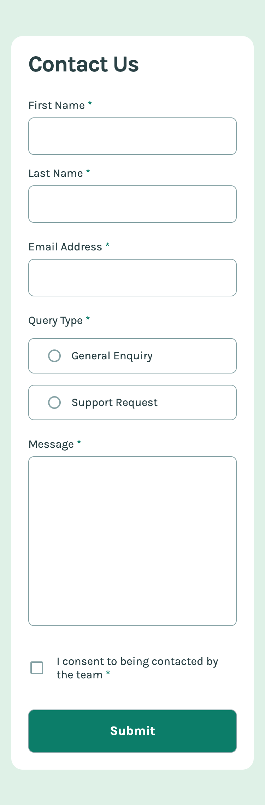

# Frontend Mentor - Contact form solution

This is a solution to the [Contact form challenge on Frontend Mentor](https://www.frontendmentor.io/challenges/contact-form--G-hYlqKJj). Frontend Mentor challenges help you improve your coding skills by building realistic projects.

## Table of contents

- [Overview](#overview)
  - [The challenge](#the-challenge)
  - [Screenshots](#screenshots)
  - [Links](#links)
- [My process](#my-process)
  - [Built with](#built-with)
  - [What I learned](#what-i-learned)
  - [Continued development](#continued-development)
  - [Useful resources](#useful-resources)
- [Author](#author)

## Overview

### The challenge

Users should be able to:

- Complete the form and see a success toast message upon successful submission
- Receive form validation messages if:
  - A required field has been missed
  - The email address is not formatted correctly
- Complete the form only using their keyboard
- Have inputs, error messages, and the success message announced on their screen reader
- View the optimal layout for the interface depending on their device's screen size
- See hover and focus states for all interactive elements on the page

### Screenshots

|             Mobile designed at 375px:              |             Tablet designed at 768px:              |             Desktop designed at 1440px:             |
| :------------------------------------------------: | :------------------------------------------------: | :-------------------------------------------------: |
|            |            |            |
|                Mobile (completed):                 |                Tablet (completed):                 |                Desktop (completed):                 |
|  |  |  |

### Links

- Solution URL: [https://github.com/elisilk/contact-form-main](https://github.com/elisilk/contact-form-main)
- Live Site URL: [https://elisilk.github.io/contact-form-main/](https://elisilk.github.io/contact-form-main/)

## My process

### Built with

- Semantic HTML5 markup
- CSS custom properties
- Flexbox
- CSS Grid
- Mobile-first workflow
- Fluid typography and spacing
- Accessible form controls

### What I learned

- [Basic native form controls](https://developer.mozilla.org/en-US/docs/Learn/Forms/Basic_native_form_controls)
- [HTML attribute: autocomplete](https://developer.mozilla.org/en-US/docs/Web/HTML/Attributes/autocomplete)
- [`color-mix()`](https://developer.mozilla.org/en-US/docs/Web/CSS/color_value/color-mix) - I learned how to mix two colors. Super cool! Used on the color for the button hover state.
- [`position: fixed`](https://developer.mozilla.org/en-US/docs/Web/CSS/position#fixed) - Positions the success modal relative to the viewport.
- [Inclusively Hiding & Styling Checkboxes and Radio Buttons](https://www.sarasoueidan.com/blog/inclusively-hiding-and-styling-checkboxes-and-radio-buttons/) - I absolutely love this explanation of how to make inclusive checkboxes and radio buttons. I didn't follow the solution exactly, but definitely utilizie much of it.
- [Form validation](https://developer.mozilla.org/en-US/docs/Learn/Forms/Form_validation) - Form validation more generally is something I struggled with on this challenge. I feel like I get the general idea and was able to make it work. But there are still some funny things I'm trying to figure out and come up with better solutions for.
  - [ValidityState](https://developer.mozilla.org/en-US/docs/Web/API/ValidityState)
  - [HTMLSelectElement: `checkValidity()` method](https://developer.mozilla.org/en-US/docs/Web/API/HTMLSelectElement/checkValidity)
  - [Constraint validation](https://developer.mozilla.org/en-US/docs/Web/HTML/Constraint_validation)
  - [HTML Input Validation with JavaScript](https://www.aleksandrhovhannisyan.com/blog/html-input-validation-without-a-form/)
  - [When and how to choose HTML for form validation](https://blog.logrocket.com/when-how-to-choose-html-form-validation/)
  - [Understanding Form Input Validation in HTML5 and JavaScript](https://www.ituonline.com/blogs/form-input-validation/)
  - [Form Validation Using JavaScript’s Constraint Validation API](https://medium.com/stackanatomy/form-validation-using-javascripts-constraint-validation-api-fd4b70720288)
- [How to Prevent Form Validation on Page Load & While Typing on Input Field (HTML Constraint Validation API)](https://usefulangle.com/post/244/html-form-prevent-validation-on-page-load) - Details like when to actually trigger the validation is one issue that I am still working through.
- [Validation messages](https://www.accessibility-developer-guide.com/examples/forms/validation-messages/) - And then making sure the validation messages are accessible is another level that I am continuing to think through.
- [Can the :not() pseudo-class have multiple arguments?](https://stackoverflow.com/questions/5684160/can-the-not-pseudo-class-have-multiple-arguments)

### Continued development

Specific areas that the solution should be improved (known issues):

- Animate the showing and hiding of the success modal.
- Should be able to dismiss the success modal by pressing any key (or maybe just the escape key) or clicking somewhere.
- When finalizing and submitting the form successfully from an input field that previously had an error, that input element continues to have an error even after form submission. The error should be cleared along with all the others.
- The error messages don't seem to go away in the radio and checkboxes after a choice has been made (but before form submission).
- The "Query Type \*" legend seems to break onto multiple lines when viewing in Safari on my iPhone.

More general ideas I want to consider:

- [`Window: clearTimeout() method`](https://developer.mozilla.org/en-US/docs/Web/API/Window/clearTimeout) - I want to learn how to use this method in the context of breaking out of a [`setTimeout()`](https://developer.mozilla.org/en-US/docs/Web/API/Window/setTimeout) early. Like, for example, if I keep the success modal open for a certain amount of time, but then can break out of that by hitting the `esc` key or clicking somewhere in the viewport.
- Make sure that my custom radio buttons and checkboxes implementation is fully accessible checked against these resources:
  - [One last time: custom styling radio buttons and checkboxes](https://www.scottohara.me/blog/2021/09/24/custom-radio-checkbox-again.html)
  - [a11y_styled_form_controls](https://scottaohara.github.io/a11y_styled_form_controls/)
- Should the success popup be implemented using [`<dialog>`: The Dialog element](https://developer.mozilla.org/en-US/docs/Web/HTML/Element/dialog)? I think probably so. It seems more semantically appropriate than any kind of custom approach, and is [probably more accessible as result too](https://www.scottohara.me/blog/2023/01/26/use-the-dialog-element.html).
- [Decide if there's any WIA-ARIA](https://www.frontendmentor.io/learning-paths/introduction-to-web-accessibility-mXu-9PHVsd/steps/670410d55832c087f2b07542/article/read) that I should be including in the solution. Maybe [landmark roles](https://developer.mozilla.org/en-US/blog/aria-accessibility-html-landmark-roles/)?
- [Event bubbling](https://developer.mozilla.org/en-US/docs/Learn/JavaScript/Building_blocks/Event_bubbling) - In asking myself the question of ["blur vs focusout -- any real differences?"](https://stackoverflow.com/questions/8973532/blur-vs-focusout-any-real-differences), that got me wanting to learn much more about what is event bubbling, and how do DOM events work more generally. I feel like there is more here that I am not getting and would be worth delving into further.

### Useful resources

- [Accessibility Developer Guide](https://www.accessibility-developer-guide.com/)
- [MDN Web Docs for CSS](https://developer.mozilla.org/en-US/docs/Web/CSS) - Went here a lot to reference the different CSS properties and the shorthands, and all the great explanations about best practices.
- [MDN Guides](https://developer.mozilla.org/en-US/docs/Learn)
- [The Clamp Calculator](https://royalfig.github.io/fluid-typography-calculator/) - Used for all of fluid typography and fluid spacing calculations.

## Author

- Website - [Eli Silk](https://github.com/elisilk)
- Frontend Mentor - [@elisilk](https://www.frontendmentor.io/profile/elisilk)
